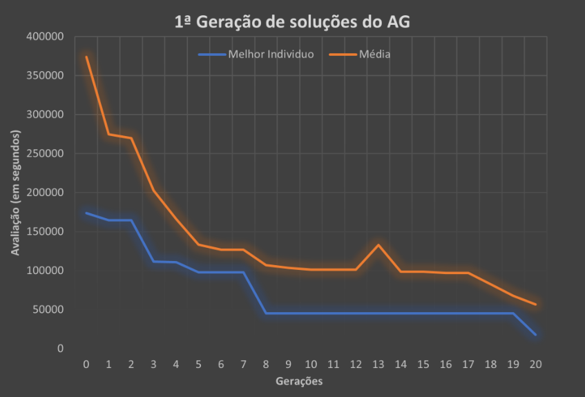
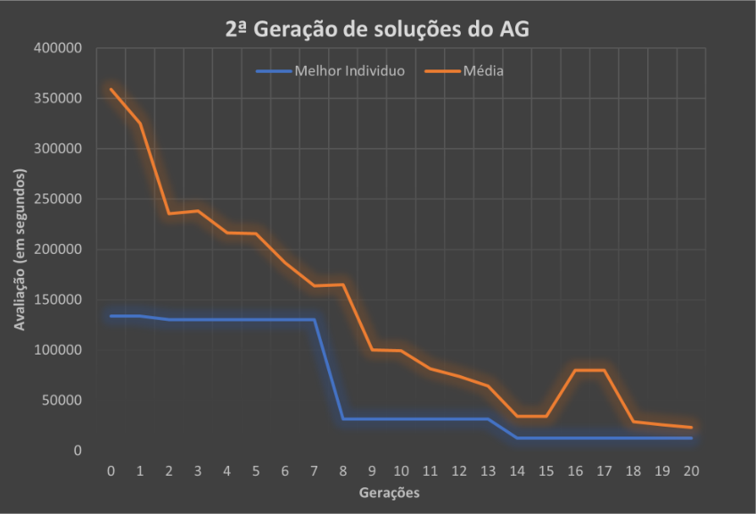
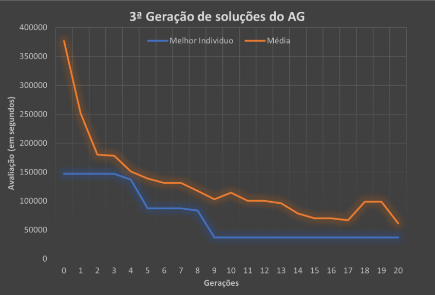
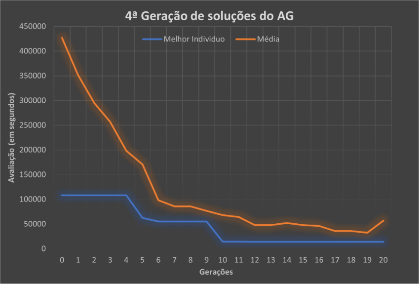

# Sprint 2

* ## Representação do conhecimento do domínio

Workblocks:

```prolog
% workblock(WorkBlock, List_of_Trips, StartTime, EndTime)
workblock(12,[459],34080,37620).
workblock(211,[31,63],37620,41220).
workblock(212,[33,65],41220,44820).
workblock(213,[35,67],44820,48420).
workblock(214,[37,69],48420,52020).
workblock(215,[39,71],52020,55620).
workblock(216,[41,73],55620,59220).
workblock(217,[43,75],59220,62820).
workblock(218,[45,77],62820,66420).
workblock(219,[48,82],66420,70020).
workblock(220,[52,86],70020,73620).
workblock(221,[56,432],73620,77220).
workblock(222,[460],77220,77340).
```

Vehicle Duty:

```prolog
%vehicleduty(Key, List_of_workblocks)
vehicleduty(12,[12,211,212,213,214,215,216,217,218,219,220,221,222]).
```

Horários:

```prolog
horario(38,459,[34080,34200]).
horario(3,31,[37800,38280,38580,38880,39420]).
horario(1,63,[39600,40140,40440,40740,41220]).
horario(3,33,[41400,41880,42180,42480,43020]).
horario(1,65,[43200,43740,44040,44340,44820]).
horario(3,35,[45000,45480,45780,46080,46620]).
horario(1,67,[46800,47340,47640,47940,48420]).
horario(3,37,[48600,49080,49380,49680,50220]).
horario(1,69,[50400,50940,51240,51540,52020]).
horario(3,39,[52200,52680,52980,53280,53820]).
horario(1,71,[54000,54540,54840,55140,55620]).
horario(3,41,[55800,56280,56580,56880,57420]).
horario(1,73,[57600,58140,58440,58740,59220]).
horario(3,43,[59400,59880,60180,60480,61020]).
horario(1,75,[61200,61740,62040,62340,62820]).
horario(3,45,[63000,63480,63780,64080,64620]).
horario(1,77,[64800,65340,65640,65940,66420]).
horario(3,48,[66600,67080,67380,67680,68220]).
horario(1,82,[68400,68940,69240,69540,70020]).
horario(3,52,[70200,70680,70980,71280,71820]).
horario(1,86,[72000,72540,72840,73140,73620]).
horario(3,56,[73800,74280,74580,74880,75420]).
horario(1,432,[75600,76140,76440,76740,77220]).
horario(39,460,[77220,77340]).
```

Representação do número de workblocks que o motorista trabalhará:

```prolog
lista_motoristas_nworkblocks(12,[(276,2),(5188,3),(16690,2),(18107,6)]).
```

Horas Contratuais do motorista:

```prolog
horasLimiteContratuais(12,[(36000,45000,276),(30000,70000,5188),
(55000,75000,16690)]).
```

Soft Constraint - Horas que o motorista prefere trabalhar:

```prolog
preferenciaHorarios([(36000,68400,276),(28800,57600),(46800,75600,16690),
(25200,64800,18107)]).
```

Cada indivíduo é um conjunto de cromossomas sendo cada cromossoma a indentificação de indivíduo. Em
prolog seria algo como:

```prolog
individuo([5188,18107,18107,276,5188,18107,16690,16690,5188,18107,18107,276,18107]
).
```

Para ajudar na resolução do problema foram utilizadas agendas e pausas, sendo as **agendas** a representação dos
blocos de trabalho e as **pausas** as interrupções entre blocos de trabalho.

```prolog
agenda(37620,48420,5188).
agenda(55620,62820,5188).
```
```prolog
pausa(48420,55620,5188).
```

----------------------

* ## Operadores de cruzamento e mutação implementados

Em relação ao cruzamento, foram efetuadas algumas alterações visto que o algoritmo genético
disponibilizado não permitia a repetição de cromossomas dentro de um indivíduo e a especificação do número de vezes que cada cromossoma deve ser representado. Desta forma, foi excluido o algoritmo que elimininava os repetidos e foi alterado o algoritmo de inserção de forma a que este colocasse
precisamente cada cromossoma, o número de vezes que este é especificado no **lista_motoristas_nworkblocks**.

```prolog
cruzar(Ind1,Ind2,P1,P2,NInd11):-
lista_motoristas_nworkblocks(_,Lista),
sublista(Ind1,P1,P2,Sub1),
numero_worblocks(NumT),
R is NumT-P2,
rotate_right(Ind2,R,Ind21),
P3 is P2 + 1,
insere(Ind21,Sub1,P3,Lista,NInd1),
eliminah(NInd1,NInd11).
insere([],L,_,_,L):-!.
insere([X|R],L,N,Lista,L2):-
numero_worblocks(T),
((N>T,!,N1 is N mod T);N1 = N),
nth0(_,Lista,(X,NVezes)),
getNTimesInList(X,L,TimesInList),
(
(NVezes>TimesInList,
insere1(X,N1,L,L1),
N2 is N + 1,
insere(R,L1,N2,Lista,L2))
;
(insere(R,L,N,Lista,L2))
),!.
insere1(X,1,L,[X|L]):-!.
insere1(X,N,[Y|L],[Y|L1]):-
N1 is N-1,
insere1(X,N1,L,L1).
getNTimesInList(_,[],0).
getNTimesInList(X,[X|T],N):-
getNTimesInList(X,T,NTemp),
N is NTemp + 1,!.
getNTimesInList(X,[_|T],N):-
getNTimesInList(X,T,N),!.
```

------------------------

* ## Aliatoriedade no cruzamento entre individuos da população

Fazendo um random_permutation foi possível
antes de fazer o cruzamento, organizar a lista de indivíduos de forma aleatória, impedindo que o cruzamento
fosse sempre realizado entre membros próximos na lista.

```prolog
...
random_permutation(Pop,PermList),
cruzamento(PermList,NPop1),
..
```

------------------

* ## Restrições consideradas (hard e soft contraints) e implementação do cálculo da função de avaliação

Restrições consideradas:
* Entre os instantes 39600 (11:00) e 54000 (15:00) o motorista deve ter 3600 segundos (1 hora, valor assumido por nós) livres para almoçar;
* Entre os instantes 64800 (18:00) e 79200 (22:00) o motorista deve ter 3600 segundos (1 hora, valor assumido por nós) livres para jantar;
* Número máximo de horas consecutivas que o motorista pode fazer – 4 horas (14400 segundos);
* Se o motorista atingir as 4 horas consecutivas deve fazer um intervalo mínimo de 1 hora;
* Número máximo de horas diárias que o motorista pode fazer – 8 horas (28800 segundos);
* Hora limite inferior e superior para trabalho do motorista, por exemplo o motorista só pode trabalhar no autocarro em questão das 8:00 às 12:00 (e isso pode dever-se a obrigações contratuais ou até ao facto de termos prevista a parte da manhã para trabalho no autocarro em questão e a da tarde noutro autocarro);
* Preferências de Horários dos Motoristas, por exemplo trabalhar depois das 10:00 e acabar antes das 20:00.

O algoritmo de avaliação obtem a penalização de cada um dos algoritmos de cada restrição para um
determinado indivíduo e soma todas as penalizações obtidas, sendo que, um indivíduo com avaliação 0 seria o ideal.

------------------------

* ## Seleção da nova geração da população

Na seleção da nova geração, foi utilizado um método não elitista, dando este uma probabilidade de 10% de
qualquer individuo passar à próxima geração. 

---------------------------

* ## Parametrização da condição de término do Algoritmo Genético

4 propostas de término:

* Nº de gerações
* Tempo limite
* Obtenção de um indivíduo com valor da função de avaliação menor ou igual a um valor indicado
* Estabilização da população

-----------------------------

* ## Análise da evolução do valor da função de avaliação do melhor indivíduo e da média de todos os indivíduos de cada geração do AG

É expectável que o primeiro indivíduo melhore ao longo das gerações (mesmo que não melhore em todas), e
é esperado que a média se comporte da mesma forma, podendo ter pequenos aumentos ao longo do tempo.
Abaixo vê-se os gráficos correspondentes às gerações de soluções do AG onde os parâmetros
utilizados foram os seguintes:

* Nº de gerações: 20
* Dimensão da população: 7
* Probabilidade de cruzamento: 75%
* Probabilidade de mutação: 5%
* Tempo limite: 3s
* Avaliação especifica: 0
* Número de gerações até estabilização: 20

---------------






------------------

| **Gama de variação** | **Melhor individuo na geração 0** | **Melhor individuo na geração 20** | **Média da geração 0** | **Média da geração 20** |
|----------------------|-----------------------------------|------------------------------------|------------------------|-------------------------|
| Valor mais baixo     | 108100                            | 12540                              | 427082.9               | 23108.6                 |
| Valor mais alto      | 173640                            | 37140                              | 291605.7               | 61528.6                 |

---------------------

* ## Proposta de duas heurísticas rápidas de criação de uma solução

Na heurística utilizada, prevalece o tempo de execução a custo de uma melhor solução inicial. Outros exemplos de heurísticas seriam:
* Colocar o motorista em workblocks consecutivos sem ultrapassar 4 horas, sequenciando de acordo com o horário de início mais cedo
* Colocar os motoristas de acordo com as suas preferências de horários sempre que possível.


Em ambos os casos o tempo de execução aumentaria ligeiramente. Em relação aos resultados das avaliações
dos individuos aplicando a heurística das preferências de horários, seria notório apenas uma pequena melhoria
em relação à heurística aqui utilizada.

----------------


